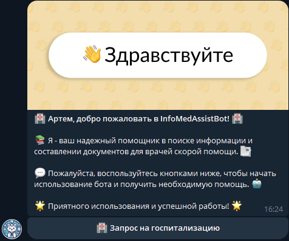
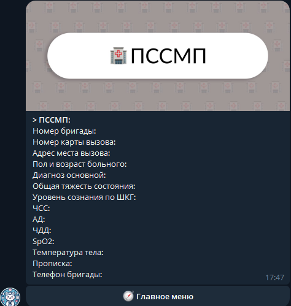

🚑 The project is aimed at automating the process of hospitalization registration in the Moscow Region ambulance service using a Telegram bot. The bot will process voice commands from users, recognizing text information and automatically filling in the necessary fields for transmission to the hospitalization chat. This will reduce call processing time and improve data accuracy. Key features include recording data about the team, diagnosis, patient condition, and contact information. The project aims to improve coordination between the ambulance crew and hospitals by simplifying and speeding up the process of information transfer and hospitalization processing.

<h2> 🧰 Languages and Tools </h2>

 

<h2> 📱 Interface </h2>

<h3> 🚩 Start page </h3>

<h3> 👋 First page </h3>

<h3> 📝 Form page </h3>

 
